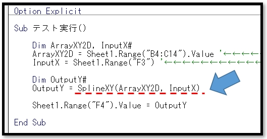

# VBA-SplineXY
- License: The MIT license

- Copyright (c) 2021 YujiFukami

- 開発テスト環境 Excel: Microsoft® Excel® 2019 32bit 

- 開発テスト環境 OS: Windows 10 Pro

実行環境など報告していただくと感謝感激雨霰。

# 説明
二次元配列（X,Y）において指定値Xにおけるスプライン補間値Yを出力する

## 活用例
スプライン補間計算ができる

# 使い方
実行サンプル「Sample-SplineXY.xlsm」の中の使い方は以下の通り。

サンプル中身

セル[B4:C14]がスプライン補間対象の二次元配列

セル[F3]に補間の指定値X(任意に変更可能)

「テスト実行」ボタンを押した後

セル[F4]に補間値Yが出力される。

また[F8]にはプロシージャ[SplineXY]がシート関数としての使用例で入力してある。

プロシージャ中身

プロシージャ「SplineXY」が使われている。

引数は

-  ArrayXY2D  補間対象の二次元配列（X,Y）

-  InputX     補間の指定位置X

## 設定
実行サンプル「Sample-SplineXY.xlsm」の中の設定は以下の通り。

### 設定1（使用モジュール）

-  ModTest.bas
-  ModSplineXY.bas

### 設定2（参照ライブラリ）
なし

